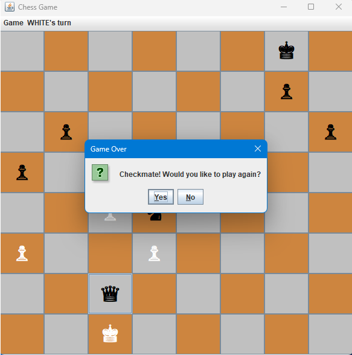

# Chess-Game

## Overview
Chess-Game is a Java-based chess game application with a graphical user interface (GUI) built using Swing. The game allows two players to play chess on the same computer, providing a visual representation of the chessboard and pieces.

## Features
- Full implementation of chess rules, including check, checkmate, and stalemate.
- Graphical user interface for easy interaction.
- Reset game option to start a new game.
- Highlighting of legal moves for selected pieces.

## Installation
1. Clone the repository:
    ```sh
    git clone https://github.com/404-heisenberg/Chess-Game.git
    ```
2. Navigate to the project directory:
    ```sh
    cd Chess-Game
    ```
3. Navigate to the `target` directory:
    ```sh
    cd target
    ```
4. Ensure you have the correct version of Java installed. You can check your Java version with:
    ```sh
    java -version
    ``````

## Usage
1. Run the application:
    ```sh
    java -jar chess-game-1.0.jar
2. The chessboard will be displayed. Players can click on pieces to see their legal moves and make moves by clicking on the destination square.
3. Use the "Reset" option in the "Game" menu to start a new game.

## Screenshots
Here are some screenshots of the game in action:

### Initial Game State


### Highlighting Legal Moves


### Castling


### Check State


### Pawn Promotion


### Checkmate State


